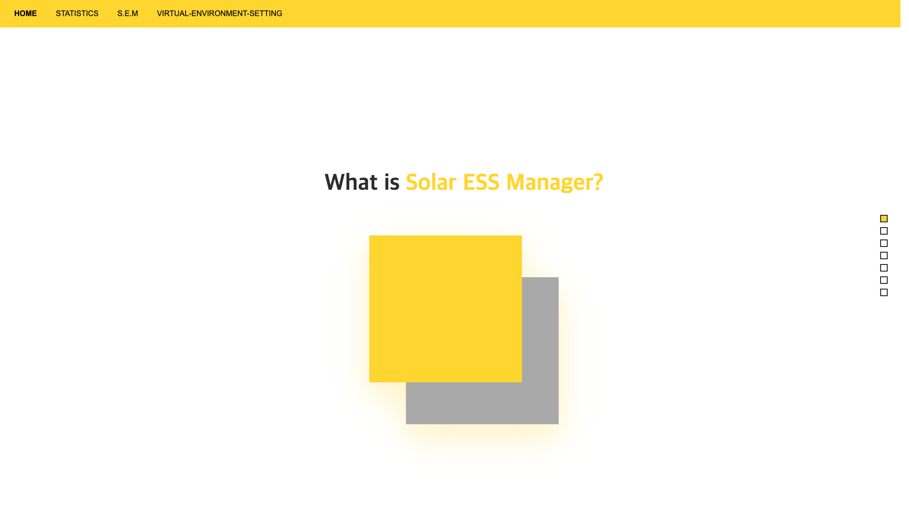
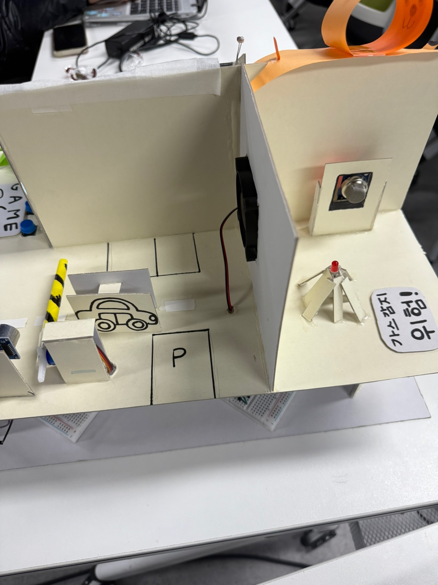
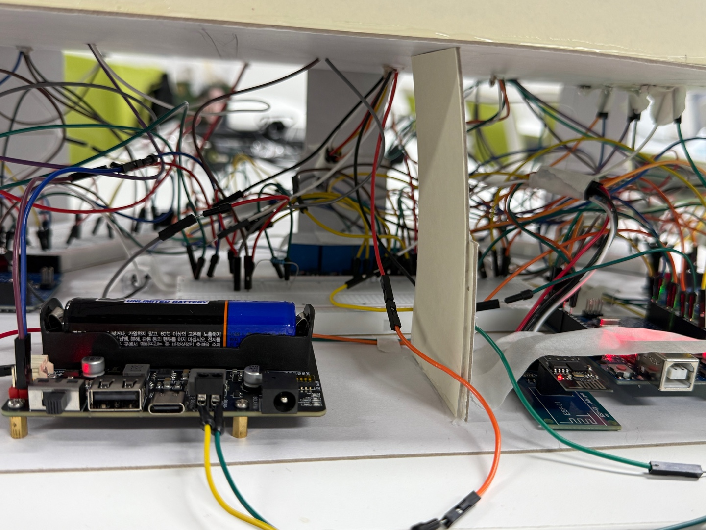

# ⚡ Solar ESS Manager (S.E.M)

**Team**: Watt's Up?

AI 기반 태양광 에너지 저장 시스템(ESS) 관리 플랫폼 - RandomForest 머신러닝으로 발전량을 예측하고, IoT 센서와 릴레이 제어를 통해 가구별 최적 전력 분배를 자동화하는 통합 시스템

---

## ⚠️ 배포 상태

프로젝트 기간 종료 후 백엔드 및 프론트엔드 서버가 중단될 수 있으므로 **로컬 환경 실행을 권장**합니다.
아래 [로컬 실행 가이드](#-로컬-실행-가이드)를 참고하세요.

---

## 📖 프로젝트 소개

### 개발 배경

태양광 발전의 간헐성 문제를 해결하고, 가정 내 에너지 자립도를 높이기 위해 **에너지 저장 시스템(ESS)의 효율적 관리**가 필요합니다.
본 프로젝트는 머신러닝 예측과 IoT 기술을 결합하여 에너지 생산-저장-분배를 자동화하는 스마트 솔루션을 제공합니다.

### 주요 특징

- **ML 기반 발전량 예측**: RandomForest 모델로 1/2/3시간 후 태양광 발전량 예측
- **실시간 IoT 모니터링**: 아두이노 센서를 통한 SOC(배터리 잔량), 발전량, 일사량 실시간 수집
- **가구별 전력 분배**: 4채널 릴레이 제어로 최적의 에너지 판매 조합 자동 추천
- **배터리 보호 시스템**: SOC 10% 이하 시 자동 판매 차단
- **실시간 대시보드**: React + Recharts 기반 시각화 인터페이스
- **이중 모드 지원**: 백엔드 연결 시 실시간 데이터, 미연결 시 시뮬레이션 모드

### 시스템 흐름도

```
[태양광 패널]
    ↓ (발전)
[배터리 (ESS)]
    ↓ (센서 측정)
[아두이노]
    ├─→ 조도 센서 → lux 측정
    ├─→ 전압 센서 → 발전량(W) 측정
    └─→ 배터리 잔량 → SOC(%) 측정
        ↓ (HTTP POST)
[Flask 백엔드]
    ├─→ MySQL DB 저장
    ├─→ RandomForest 예측 (1/2/3시간 후 발전량)
    ├─→ 최적 채널 조합 계산 (배낭 알고리즘)
    └─→ 릴레이 상태 관리
        ↓ (REST API)
[React 프론트엔드]
    ├─→ 실시간 차트 대시보드
    ├─→ 전력 거래 인터페이스
    └─→ 최적 조합 시각화 (💡 아이콘)
        ↓ (사용자 선택)
[릴레이 제어]
    ↓
[가구 A, B, C, D] (전력 분배)
```

---

## 📸 프로젝트 스크린샷

### 웹 인터페이스

#### 메인 홈페이지



#### 전력 거래 페이지


### 하드웨어 구성

#### 릴레이 채널별 테마 (1)


#### 릴레이 채널별 테마 (2)



#### 아두이노 회로 구성



---

## 📁 프로젝트 구조

```
SolarESSManager/
├── frontend/                     # React 프론트엔드
│   ├── src/
│   │   ├── api/                  # API 통신 레이어
│   │   │   ├── channelAPI.js    # 채널 관련 API
│   │   │   ├── client.js        # Axios 클라이언트
│   │   │   ├── config.js        # 백엔드 URL 설정
│   │   │   ├── dataAPI.js       # 센서 데이터 API
│   │   │   ├── energyAPI.js     # 에너지 예측 API
│   │   │   └── relayAPI.js      # 릴레이 제어 API
│   │   ├── components/
│   │   │   └── Navbar.jsx       # 네비게이션 바
│   │   ├── hooks/
│   │   │   ├── useBackendStatus.js  # 백엔드 연결 상태 관리
│   │   │   └── usePolling.js        # 폴링 훅 (10초 주기)
│   │   ├── pages/
│   │   │   ├── Home.jsx         # 프로젝트 소개 페이지
│   │   │   ├── Statistics.jsx   # 통계/예측 대시보드
│   │   │   ├── Trade.jsx        # 전력 거래 페이지
│   │   │   └── EnvSetting.jsx   # 환경 설정 페이지
│   │   ├── assets/              # 이미지 리소스
│   │   ├── App.jsx              # 메인 앱 (라우팅)
│   │   └── main.jsx             # 엔트리 포인트
│   ├── index.html
│   ├── package.json
│   ├── vite.config.js           # Vite 빌드 설정
│   └── vercel.json              # Vercel 배포 설정
│
├── backend/                     # Flask 백엔드
│   ├── api/
│   │   ├── app/
│   │   │   ├── __init__.py      # Flask 앱 팩토리
│   │   │   ├── db.py            # MySQL 연결 관리
│   │   │   ├── config/
│   │   │   │   └── config_arduino.json  # 배터리/채널 설정
│   │   │   ├── routers/         # API 엔드포인트
│   │   │   │   ├── channels_routes.py   # 채널 최적화
│   │   │   │   ├── data_routes.py       # 센서 데이터
│   │   │   │   ├── energy_routes.py     # 에너지 예측
│   │   │   │   └── relay_routes.py      # 릴레이 제어
│   │   │   └── services/        # 비즈니스 로직
│   │   │       ├── channels_service.py  # 배낭 알고리즘
│   │   │       ├── common_service.py    # 공통 유틸
│   │   │       ├── energy_service.py    # ML 예측
│   │   │       ├── relay_service.py     # 릴레이 제어
│   │   │       └── sensor_service.py    # 센서 데이터 처리
│   │   └── run.py               # 서버 실행 파일
│   ├── models/
│   │   └── rf_production_model.pkl      # RandomForest 모델
│   └── schema.sql               # MySQL 데이터베이스 스키마
│
├── ml/                          # 머신러닝 모델 개발
│   ├── config.json              # 모델 하이퍼파라미터
│   ├── data_cleaning.ipynb      # 데이터 전처리 노트북
│   └── model_train_rf.py        # RandomForest 학습 스크립트
│
├── readme_images/               # README 이미지 리소스
│   ├── web_01.png               # 메인 홈페이지
│   ├── web_02.png               # 전력 거래 페이지
│   ├── arduino_01.jpeg          # 릴레이 채널 테마 1
│   ├── arduino_02.jpeg          # 릴레이 채널 테마 2
│   └── arduino_03.jpeg          # 아두이노 회로
├── requirements.txt             # Python 의존성
└── README.md
```

---

## 🎯 기술 스택

### 🌐 Frontend

[](https://react.dev/)
[](https://vitejs.dev/)
[](https://recharts.org/)
[](https://www.framer.com/motion/)

### 🔧 Backend

[](https://flask.palletsprojects.com/)
[](https://www.mysql.com/)

### 🤖 Machine Learning

[](https://scikit-learn.org/)
[](https://scikit-learn.org/stable/modules/ensemble.html#forest)
[](https://pandas.pydata.org/)
[](https://numpy.org/)

### 🔌 Hardware

[](https://www.arduino.cc/)

### ☁️ Deployment

[](https://vercel.com/)
[](https://www.oracle.com/cloud/)

---

## 🚀 주요 기능

### 1. 실시간 센서 데이터 수집

- **위치**: `backend/api/app/routers/data_routes.py`
- **기능**:
  - 아두이노로부터 SOC, 발전량(W), 조도(lux) 데이터 수신
  - 데이터 검증 (SOC: 0~100%, 음수 방지)
  - MySQL `sun_data_realtime` 테이블에 자동 저장
- **API**: `POST /api/data/solar`

### 2. 머신러닝 기반 발전량 예측

- **위치**: `backend/api/app/services/energy_service.py`
- **모델**: RandomForest Regressor
- **입력 특성**:
  - 시간 정보 (연/월/일/시)
  - 현재 발전량
  - 1시간 전 발전량
  - 24시간 전 동일 시간 발전량
  - 일사량 (lux → MJ/m² 변환)
- **출력**: 1시간, 2시간, 3시간 후 예상 발전량 (W)
- **최적화**: `@lru_cache`로 모델 로드 캐싱
- **API**: `GET /api/energy/predicted`

### 3. 최적 채널 조합 추천

- **위치**: `backend/api/app/services/channels_service.py`
- **알고리즘**: 배낭 문제(Knapsack Problem)
- **제약 조건**:
  - 배터리 보호: SOC 10% 이하 시 판매 차단
  - 현재 발전량 고려한 에너지 가용량 계산
- **채널 설정**: A(0.6W), B(1.55W), C(0.93W), D(0.61W)
- **API**: `GET /api/channels/optimal`

### 4. 릴레이 제어 시스템

- **위치**: `backend/api/app/routers/relay_routes.py`
- **웹 → 서버**: `POST /api/relay/update` (채널 상태 업데이트, 거래 내역 저장)
- **아두이노 → 서버**: `GET /api/relay/control` (릴레이 상태를 "1010" 형식으로 반환)
- **물리적 제어**: 아두이노가 릴레이 상태를 받아 실제 전력 분배

### 5. 실시간 대시보드

- **위치**: `frontend/src/pages/Statistics.jsx`
- **기능**:
  - Recharts 기반 실시간 차트
  - 10초 주기 폴링으로 데이터 갱신
  - 실제 모드 / 가상 모드 자동 전환
  - ML 예측값과 실제값 비교 시각화

### 6. 전력 거래 시스템

- **위치**: `frontend/src/pages/Trade.jsx`
- **기능**:
  - 4개 가구(A, B, C, D) 중 판매 대상 선택
  - 💡 아이콘으로 최적 조합 표시
  - 거래 시 에너지 잔액 차감 & 가상 현금 증가 (1W = 140원)
  - localStorage 기반 거래 내역 저장
  - 릴레이 자동 제어

---

## 🔌 API 엔드포인트

### 센서 데이터

| Method | Endpoint            | 설명                                                 |
| ------ | ------------------- | ---------------------------------------------------- |
| `GET`  | `/api/data/latest`  | 최신 센서 데이터 조회                                |
| `POST` | `/api/data/solar`   | 아두이노에서 센서 데이터 수신 (SOC, 발전량, 조도)    |
| `GET`  | `/api/data/history` | 거래 내역 조회 (쿼리: user_id, start_date, end_date) |

### 에너지 예측

| Method | Endpoint                | 설명                             |
| ------ | ----------------------- | -------------------------------- |
| `GET`  | `/api/energy/predicted` | ML 기반 1/2/3시간 후 발전량 예측 |

### 릴레이 제어

| Method | Endpoint             | 설명                                             |
| ------ | -------------------- | ------------------------------------------------ |
| `POST` | `/api/relay/update`  | 릴레이 상태 업데이트 (웹 → 서버)                 |
| `GET`  | `/api/relay/status`  | 현재 릴레이 상태 조회 (웹용)                     |
| `GET`  | `/api/relay/control` | 릴레이 제어 문자열 반환 (아두이노용, 예: "1010") |

### 채널 최적화

| Method | Endpoint                  | 설명                                |
| ------ | ------------------------- | ----------------------------------- |
| `GET`  | `/api/channels/available` | 현재 선택 가능한 채널 조회          |
| `GET`  | `/api/channels/optimal`   | 최적 판매 조합 추천 (배낭 알고리즘) |

---

## 💻 로컬 실행 가이드

### 1️⃣ Backend 설정 및 실행

```bash
# 가상환경 생성 및 활성화
python -m venv venv
source venv/bin/activate  # Windows: venv\Scripts\activate

# 의존성 설치
pip install -r requirements.txt

# 환경변수 설정 (.env 파일 생성)
DB_HOST=localhost
DB_USER=root
DB_PASSWORD=your_password
DB_DATABASE=realtime_db

# MySQL 데이터베이스 및 테이블 생성
mysql -u root -p < backend/schema.sql

# 서버 실행
cd backend/api
python run.py
```

**백엔드 실행 확인**: http://localhost:5000

#### 데이터베이스 구조

| 테이블명            | 설명                    | 주요 컬럼                                 |
| ------------------- | ----------------------- | ----------------------------------------- |
| `sun_data_realtime` | 실시간 센서 데이터 저장 | timestamp, soc, solar_w, lux              |
| `sun_data_hourly`   | 시간별 집계 데이터      | date, hour, avg_soc, avg_solar_w, avg_lux |
| `relay_status`      | 릴레이 제어 상태        | relay_name (A/B/C/D), status (on/off)     |
| `trade_history`     | 전력 거래 내역          | buyer_id, amount, timestamp               |

> 📄 전체 SQL 스키마는 `backend/schema.sql`파일을 참고하세요.

### 2️⃣ Frontend 설정 및 실행

```bash
cd frontend

# 의존성 설치
npm install

# 환경변수 설정 (.env 파일 생성)
VITE_BACKEND_SERVER=http://localhost:5000

# 개발 서버 실행
npm run dev

# 프로덕션 빌드
npm run build
```

**프론트엔드 접속**: http://localhost:5173

### 3️⃣ 아두이노 설정 (선택사항)

아두이노 센서 연동을 위해서는 별도의 펌웨어 업로드가 필요합니다.

- 조도 센서 (Analog Pin)
- 전압 센서 (Analog Pin)
- 4채널 릴레이 모듈 (Digital Pin)

---

## 🛠️ 개발 과정 및 트러블슈팅

### 주요 기술적 도전 과제

#### 1. 아두이노 버퍼 오버플로우 문제

**문제**: 아두이노가 `/api/relay/control` 엔드포인트에서 JSON 응답을 받지 못함

- 기존 응답 형식: `{"A": true, "B": false, "C": true, "D": false}`
- 아두이노의 제한된 메모리로 인해 HTTP 응답 버퍼 오버플로우 발생

**해결**:

```python
# 릴레이 상태를 간결한 문자열로 변환
# True → "1", False → "0"
return "1010"  # A=on, B=off, C=on, D=off

# 서버 헤더 최소화로 응답 크기 감소
WSGIRequestHandler.server_version = "S"
WSGIRequestHandler.sys_version = ""
```

- JSON 대신 4자리 문자열(`"1010"`)로 단순화
- 서버 헤더 최소화로 HTTP 응답 크기 대폭 감소
- 아두이노 메모리 사용량 최적화 성공

#### 2. DB 연결 코드 중복 문제

**문제**: 모든 API 엔드포인트에서 DB 연결/종료 코드가 반복됨

- 연결 실패 처리, 커밋/롤백, 에러 핸들링 로직이 분산
- 코드 유지보수성 저하 및 실수 가능성 증가

**해결**: Context Manager 패턴 적용

```python
@contextmanager
def db_transaction():
    """DB 연결 및 트랜잭션 관리를 한 줄로 처리"""
    conn, cursor = None, None
    try:
        conn, cursor = get_connection()
        if conn is None:
            raise DBException("Connection failed", 503)
        yield conn, cursor  # 함수 일시 정지 & 변수 전달
        conn.commit()       # 정상 처리 시 자동 커밋
    except Exception as e:
        if conn:
            conn.rollback()  # 에러 발생 시 자동 롤백
        raise DBException(f"Database Error: {e}", 500)
    finally:
        close_connection(conn, cursor)  # 항상 연결 종료

# 사용 예시 (코드가 대폭 간결해짐)
with db_transaction() as (conn, cursor):
    cursor.execute("SELECT * FROM sensor_data")
    data = cursor.fetchall()
```

- 모든 엔드포인트에서 `with db_transaction()` 한 줄로 재사용
- 자동 커밋/롤백으로 트랜잭션 안정성 보장
- 코드 가독성 및 유지보수성 향상

#### 3. 머신러닝 모델 선택

**고려한 모델**: RandomForest (RF), GradientBoosting (GB), LSTM

**RandomForest 선택 이유**:

- **빠른 예측 속도**: 실시간 API 응답에 적합
- **가벼운 모델 크기**: 서버 메모리 효율적 (pickle 파일 약 1MB)
- **데이터 특성에 적합**: 태양광 발전량은 일정한 주기 패턴을 가진 데이터
  - 일출/일몰 시간에 따른 규칙적 변화
  - 계절별 반복 패턴
  - 복잡한 비선형 패턴보다는 시간/날씨 기반 선형적 관계
- **과적합 방지**: 앙상블 기법으로 안정적인 예측
- **특성 중요도 분석 가능**: 어떤 변수가 예측에 중요한지 해석 가능

**비교 결과**:

- **LSTM**: 복잡한 시계열 패턴 학습 가능하지만, 규칙적인 태양광 데이터에서는 오히려 과적합 발생 및 예측 속도 느림
- **GradientBoosting**: 정확도는 유사하나 학습 시간이 길고 하이퍼파라미터 튜닝 복잡
- **RandomForest**: 단순하면서도 충분한 성능, 빠른 추론 속도

**최종 하이퍼파라미터**:

```python
{
  "n_estimators": 100,
  "max_depth": 20,
  "min_samples_split": 5,
  "min_samples_leaf": 5
}
```

---

## 🏆 성과 및 배운 점

### 프로젝트 성과

- ✅ **End-to-End IoT 시스템 구축**: 하드웨어-백엔드-프론트엔드 완전 통합
- ✅ **ML 모델 실전 배포**: RandomForest 모델을 Flask API로 서빙
- ✅ **실시간 데이터 파이프라인**: 센서 수집 → DB 저장 → 웹 시각화 (10초 주기)
- ✅ **최적화 알고리즘 적용**: 배낭 문제 해결로 에너지 효율 극대화

### 배운 점

- 시계열 특성 엔지니어링 및 RandomForest 모델 최적화
- Flask REST API 설계 및 백엔드 로직 구현
- API 엔드포인트 모듈화
- pickle 기반 모델 배포 및 API 서빙 경험

---

## 👥 팀원 구성

|               |                                                          오왕경                                                          |                                                             안태현                                                              |                                                           이민정                                                            |                                                           윤태훈                                                            |                                                             최하연                                                              |
| :-----------: | :----------------------------------------------------------------------------------------------------------------------: | :-----------------------------------------------------------------------------------------------------------------------------: | :-------------------------------------------------------------------------------------------------------------------------: | :-------------------------------------------------------------------------------------------------------------------------: | :-----------------------------------------------------------------------------------------------------------------------------: |
|   **역할**    |                                                     팀장 / Frontend                                                      |                                                      ML Engineer / Backend                                                      |                                                           Backend                                                           |                                                     Backend / Hardware                                                      |                                                            Hardware                                                             |
| **담당 업무** |                                 React UI/UX 설계<br/>실시간 차트 구현<br/>반응형 디자인                                  |                                RandomForest 예측 모델<br/>데이터 전처리<br/>Flask REST API 구현                                 |                                    Oracle 서버 구축<br/>MySQL 설계<br/>서버 인프라 관리                                     |                             아두이노 센서 회로<br/>릴레이 제어<br/>데이터 전처리<br/>HW-SW 통신                             |                                        아두이노 센서 회로<br/>릴레이 제어<br/>HW-SW 통신                                        |
|  **GitHub**   | [](https://github.com/Q5dis) | [](https://github.com/taehyunan-99) | [](https://github.com/naas0523) | [](https://github.com/taehun96) | [](https://github.com/choi-hayeonn) |
|   **Email**   |                                                    qowkqowk@gmail.com                                                    |                                                       withblua@gmail.com                                                        |                                                     naas0523@gmail.com                                                      |                                                      jk3160@naver.com                                                       |                                                      gkdus011020@gmail.com                                                      |

---

## 📊 데이터 출처

본 프로젝트는 다음 공개 데이터를 활용하여 개발되었습니다.

- **공공데이터포털 API**: 시간별 태양광 패널 발전량 데이터

  - 제공: 행정안전부 공공데이터포털
  - 용도: RandomForest 모델 학습 및 발전량 예측

- **기상청 데이터**: 일사량 데이터
  - 제공: 기상청
  - 용도: ML 모델 특성(feature)으로 활용하여 예측 정확도 향상

---

## 📝 라이센스

본 프로젝트는 교육 목적으로 제작되었습니다.

---
